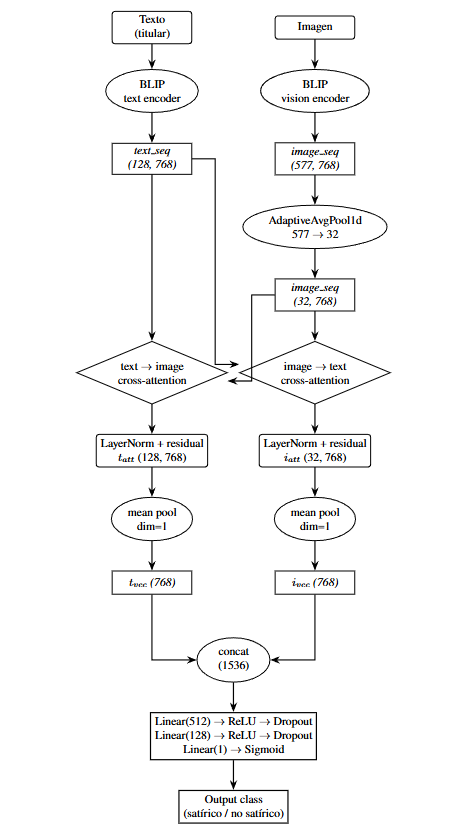

# Semantic Manipulation Detection through Multimodal Analysis

**Bachelor's Thesis (B.Sc. Software Engineering) - Universidad Complutense de Madrid, 2026 - Final grade: 10/10**

A controlled empirical study of multimodal satire detection: I reproduce a state-of-the-art pipeline, isolate what actually drives its reported performance, and propose an attention-based fusion architecture that improves on it consistently. Built in PyTorch with a reproducibility-first methodology.

> ### ℹ️ Why this repo only contains a README
>
> This thesis was carried out within the **INCIBE-UCM Chair** and the **CIRMA-CM research project**, and the university required the working code to be kept in a private repository. This README is therefore a public summary of the work and my contribution, not the codebase.
>
> **The full code and manuscript are available on request**, subject to institutional clearance, reach out (see profile) and I'll share what I can.

---

## Summary

- Reproduced a published SOTA satire-detection pipeline (BLIP + CLIP + Gemma LLM + dense classifier) and matched its reported ~98.7% accuracy.
- Showed that number is mostly a dataset artifact: swapping the single-source satire dataset (BabylonBee) for a stylistically heterogeneous one (Fakeddit Satire), changing nothing else, drops accuracy to ~84%. Source homogeneity, not semantic understanding, explained most of the result.
- Ablated the paper's central theoretical component (the incongruity signal) and proved it contributes nothing as integrated. Two scalars concatenated with 3072-dim embeddings get diluted to 0.065% of the input. The idea isn't wrong but the integration mechanism is.
- Proposed bidirectional cross-attention over full BLIP token/patch sequences instead of simple concatenation, giving a consistent gain on both datasets (≈+1 pt on the hard dataset, +0.85 on the original).

## The pipeline I contributed

Bidirectional cross-attention that lets each modality condition the other's representation *during* fusion, instead of concatenating pooled vectors at the end.

**How it works (Experiment 5.6):**
1. Each (headline, image) pair passes through BLIP's text and vision encoders, kept as full sequences (128 text tokens, 577 image patches × 768-dim) rather than pooled to a single vector.
2. The visual sequence is pooled to 32 patches (`AdaptiveAvgPool1d`) to tame the O(N²) attention cost.
3. **Two symmetric cross-attention modules** (4 heads, LayerNorm + residual): text-to-image and image-to-text, so each token attends to the relevant regions of the other modality.
4. Mean-pool each conditioned sequence → concat (1536-dim) → 3-layer dense classifier → binary output.

## Experimental design

Six controlled experiments, each changing **exactly one variable** from the previous, enabling *causal attribution* of every performance change to its cause — instead of comparing whole architectures that differ in many ways at once.

| Exp | Change | Acc (%) | F1 (%) |
|---|---|---|---|
| Baseline | Faithful reproduction (BB+FKT) | 98.70 | 98.73 |
| 1 | Dataset → heterogeneous (FKS+FKT) | 83.95 | 83.21 |
| 2 | LLM → Gemma 3-4b (4-bit NF4) | 84.03 | 83.89 |
| 3 | Semantic headline split | 84.05 | 84.11 |
| 4 | Ablate incongruity component | 84.32 | 84.35 |
| 5 | **Cross-attention over sequences** | **84.98** | **84.99** |
| 6 | Cross-attention on original dataset (BB) | 99.55 | 99.56 |

## Key findings

1. **Dataset composition dominates.** A single isolated dataset change moved accuracy 14.7 points, more than all architectural and component changes combined. Benchmark headline numbers can measure source recognition, not the phenomenon they claim to detect.
2. **Component quality wasn't the bottleneck, whereas integration was.** A better LLM and a smarter headline split each helped marginally, but removing the incongruity signal entirely helped slightly more. The concatenation mechanism couldn't use the signal regardless of its quality.
3. **Structured multimodal fusion is the right direction.** Cross-attention beat concatenation consistently across both datasets, suggesting the gain is architectural, not dataset-specific.

## Stack

`PyTorch` · `Transformers` (BLIP, CLIP, BERT, Sentence-BERT) · `Gemma-1.1` and `Gemma-3` (4-bit quantization via `bitsandbytes`) · `NumPy` (memmap for ~43 GB of sequence embeddings) · reproducibility scaffolding (fixed seeds, documented substitutions, stratified splits).

**Datasets:** BabylonBee, Fakeddit (Satire/Parody & True subsets), ~20–21k multimodal samples after filtering.

---

*Directors: Luis Javier García Villalba, Daniel Povedano Álvarez - Dept. of Software Engineering & AI, Faculty of Computer Science, UCM.*

*Author: Iván Fernández López*
